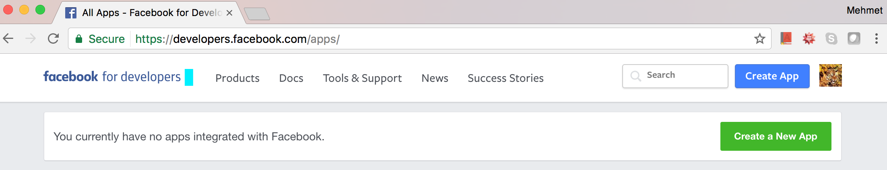
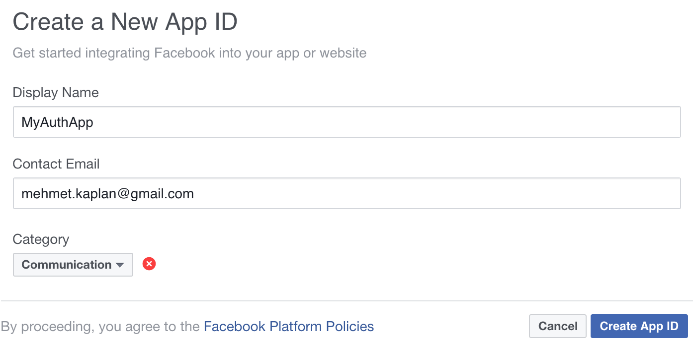
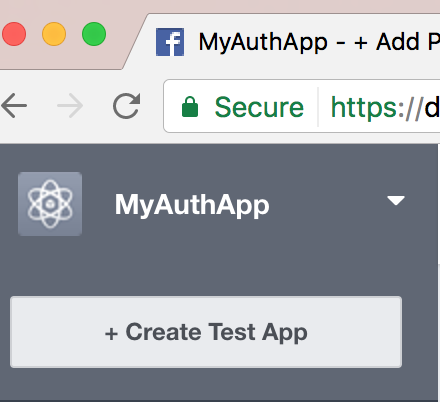
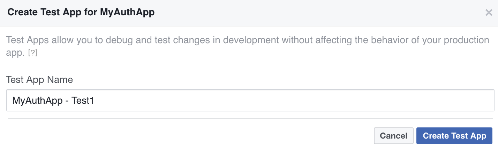
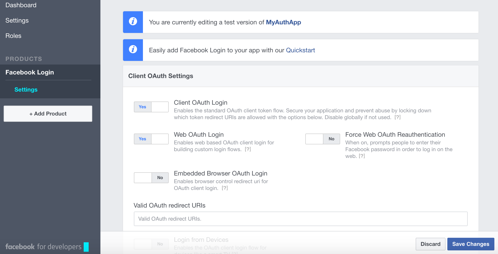
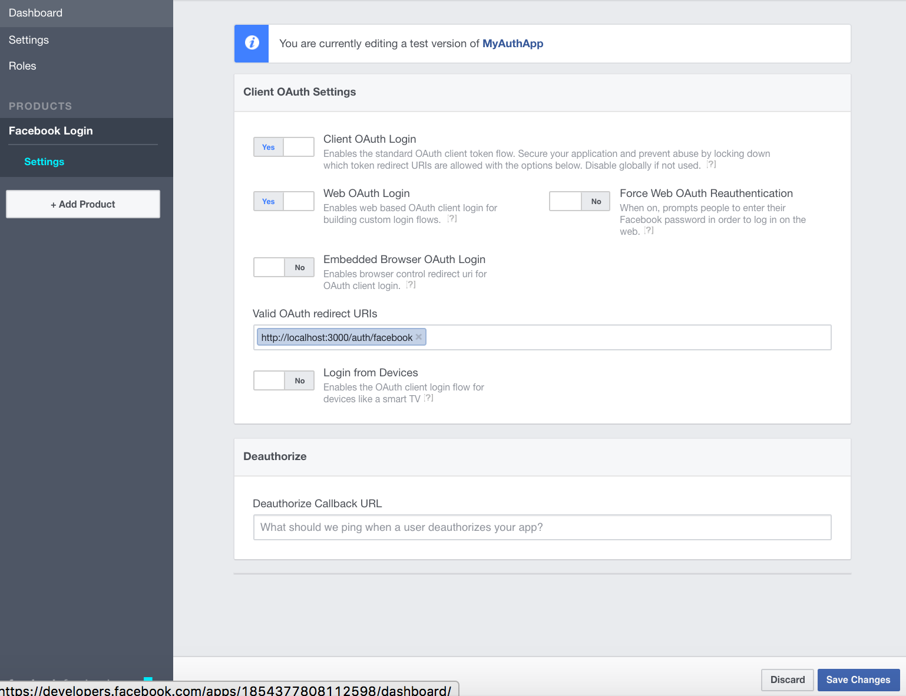
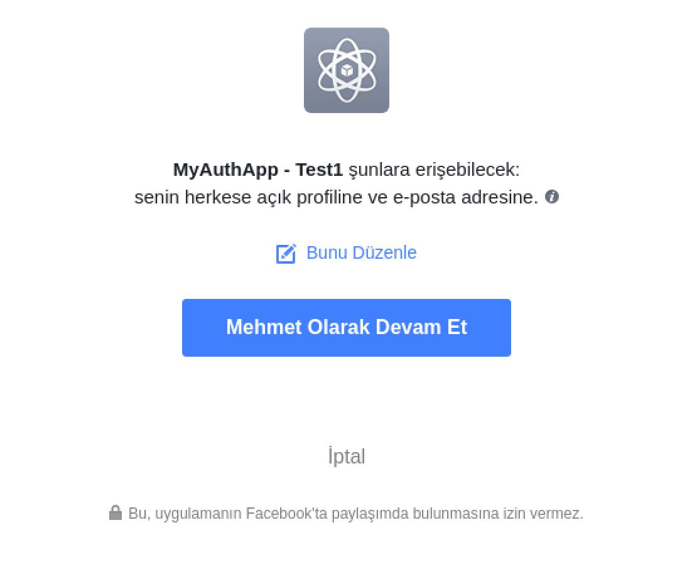

# AuthSample

This structure is generated for MOCMON user handling.

## Steps Taken

1. Install related GEMS into Gemfile
	```Ruby
	gem 'mysql2'

	# use Haml for templates
	gem 'haml'
	gem 'haml-rails'

	gem 'therubyracer'
	gem 'devise'
	gem 'omniauth'
	gem 'omniauth-facebook'

	gem 'json'
	```
	Then run:
	```Ruby
	bundle install
	```

2. Arrange database configurations within the file config/database.yml
	```Ruby
	default: &default
	  adapter: mysql2
	  encoding: utf8
	  pool: 5
	  socket: /var/run/mysqld/mysqld.sock
	  username: <%= ENV['MOCMON_DATABASE_USERNAME'] %>
	  password: <%= ENV['MOCMON_DATABASE_PASSWORD'] %>
	  database: UsersDB
 	  # ENV reaches linux environment parameters READ ONLY!
 	  #password: 
	
	development:
	  <<: *default
	
	# Warning: The database defined as "test" will be erased and
	# re-generated from your development database when you run "rake".
	# Do not set this db to the same as development or production.
	test:
	  <<: *default
	
	production:
 	 <<: *default
	```

	```
3. Set Omniauth Provider (Here example is Facebook)

	Visit site https://developers.facebook.com/apps/
	

	Generate new app:
	
	
	Generate test app under new app:

	
	

	Add Facebook login by following this path, Left Menu --> Products --> Facebook Login:
	

	Enter the callback URL and leave deauthorize URL empty to use callback URL. Enter callback URL as the root URL (ex: http://localhost:3000/auth/facebook):
	

	When ready (I said "when ready, not now!!!"), you can open your application to public:
	

	When you go to http://localhost:3000/auth/facebook you'll receive authorization screen in your facebook language:
	
	
	When you want to remove application, go to settings in your facebook account and remove by the remove button:
	

	Add your application id and secret to a safe file. (Here security is delegated to linux's file security):
	```{r, engine='bash', code_block_name}
	more /some_path/some_file.txt
	API Version: v2.8
	App ID: 123456789012345
	App Secret: xy1234xy12x1234x1x123xyz1234x12x
	```

	Add following lines to your ~/.bashrc file, so that Facebook application id and secret is kept in linux enviroment variables. <span style="color:red">Be careful to keep your enviroment secure!</span>
	```{r, engine='bash', code_block_name}
	l_ary=( $(awk '{print $3}' /some_path/some_file.txt) )
	export FB_MOCMON_Test1_Version=${l_ary[0]}
	export FB_MOCMON_Test1_ID=${l_ary[1]}
	export FB_MOCMON_Test1_Secret=${l_ary[2]}
	```

	PS: It is better to restart rails server and *full restart* your development enviroment here if you have already gone through step 5. (Remember, application id is taken from the bash which needs to be reloaded!)

4. Install OmniAuth

	Include the related gems (here I only show facebook's):
	```Ruby
	gem 'omniauth'
	gem 'omniauth-facebook'
	```

	Generate blank file ```config/initializers/omniauth.rb```:
	```{r, engine='bash', count_lines}
	touch config/initializers/omniauth.rb
	```

	Include facebook's (or any other desired providers') strategy(ies):
	```Ruby
	Rails.application.config.middleware.use OmniAuth::Builder do
		provider :facebook, ENV['FB_MOCMON_Test1_ID'], ENV['FB_MOCMON_Test1_Secret']
	end
	```

	Catch the callback (which will be initiated by provider if login is confirmed) by ```config/routes.rb```:
	```ruby
	match '/auth/:provider/callback', :to => 'sessions#create'
	```

	Generate the session controller and view
	```ruby
	rails generate controller sessions
	```

	Now generate the models for user base and their authorization 
	```ruby
	rails generate model authorization provider:string uid:string user_id:integer
	rails generate model user name:string
	```

	In order to set table relations, modify models of tables Users and Authorizations:

	```app/models/users.rb```:
	```ruby
	class User < ApplicationRecord
		has_many :authorizations
	end
	```
	```app/models/authorization.rb```:
	```ruby
	class Authorization < ApplicationRecord
		belongs_to :user
		validates_presence_of :user_id, :uid, :provider
		validates_uniqueness_of :uid, :scope => :provider
	end
	```
	Above:
	- Belongs_to is one to one relation which indicates that Authorization has a foreign key rowards usr, i.e. each Authorization row should have one user_id.
	- validates_presence_of means "not null"
	- validates_uniqueness_of means... gues what! unique! :-)

	To take those configurations to get effect:
	```ruby
	rails db:migrate 
	```
